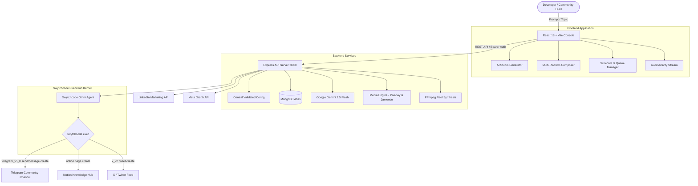

# SocialOps AI: Autonomous Omni-Channel Community Syndication via Swytchcode

[](https://swytchcode.com)
[](https://deepmind.google/technologies/gemini/)
[](https://vitejs.dev)
[](https://expressjs.com)
[](https://www.mongodb.com/atlas)
[](LICENSE)

**SocialOps AI** is an autonomous, production-grade social operations and developer advocacy platform designed for modern tech communities and engineering teams. It bridges generative AI with **Swytchcode's canonical API execution kernel** to eliminate fragmented glue code, automating content ideation, media pairing, multi-platform publishing, and audit archiving in a unified developer experience.

---

## 🚀 Key Capabilities

### 1. Omni-Channel Content Syndication
* **Simultaneous Multi-Platform Dispatches**: Publish announcements simultaneously across **Telegram** (`@SwytehBot`), **Notion** (Roadmap & Documentation Hub), **X / Twitter**, **LinkedIn**, and **Instagram**.
* **Canonical API Execution with Swytchcode**: Executes verified tools (`telegram_v5_0.sendmessage.create`, `notion.page.create`, `x_v2.tweet.create`) directly via the Swytchcode runtime kernel rather than maintaining fragile, custom HTTP clients.

### 2. Intelligent AI Studio
* **Platform-Tailored Copy Generation**: Powered by **Google Gemini 2.5 Flash**, generating:
  * **X (Twitter)**: High-impact tweets under 260 characters with relevant tech hashtags.
  * **Telegram**: Rich Markdown posts with emoji headers, bullet takeaways, and call-to-actions.
  * **Notion**: Executive summaries formatted for developer documentation hubs.
  * **LinkedIn**: In-depth thought leadership posts structured for professional engagement.
* **Smart Media Pairing**: Integrated **Pixabay** visual search and **Jamendo** audio stream library for royalty-free visual and audio pairing.

### 3. Automated Reel & Multimedia Pipeline
* **Dynamic Video Synthesis**: Automated pipeline powered by FFmpeg for resizing, typography captioning, and soundtrack mixing.
* **Direct Social Publishing**: Automated reel rendering and publishing to connected Instagram accounts.

### 4. Modern SocialOps Dashboard
* **Real-Time Queue & Scheduler**: Interactive drag-and-drop queue management and publishing timeline.
* **Live Audit Activity Logs**: Comprehensive audit trail capturing latency, trace IDs, delivery status, and payload details.
* **Channel Health Hub**: Direct status checks and connection testing across all integrated accounts.

### 5. Enterprise Security & Environment Architecture
* **Centralized & Validated Config**: Startup fail-fast validation ensures all required credentials are verified before boot.
* **Zero Hardcoded Secrets**: Complete elimination of fallback secret strings (`process.env.X || 'fallback'`).
* **Strict Browser Isolation**: Only non-sensitive, browser-safe variables (`VITE_*`) are exposed to client code.

---

## 🏛️ Architectural Overview



---

## 📁 Repository Structure

```
├── backend/
│   ├── src/
│   │   ├── config/
│   │   │   ├── env.js                # Centralized, validated environment configuration
│   │   │   └── imagekit.js           # ImageKit client config
│   │   ├── controllers/              # Request handlers (socialController, authController, etc.)
│   │   ├── db/                       # Mongoose connection and post seeding
│   │   ├── middlewares/              # Role verification & JWT validation
│   │   ├── models/                   # MongoDB models (SocialPost, SocialAccount, User)
│   │   ├── routes/                   # Express route definitions (socialRoutes, reel.routes)
│   │   ├── services/
│   │   │   ├── social/
│   │   │   │   ├── SwytchcodeOmniAgent.js  # Canonical Swytchcode tool dispatcher
│   │   │   │   ├── ContentGenerator.js    # Gemini 2.5 content generator
│   │   │   │   └── adapters/              # Platform adapters (Swytchcode, X, LinkedIn, etc.)
│   │   │   ├── ffmpeg.service.js     # Video reel synthesis
│   │   │   ├── music.service.js      # Jamendo audio streaming
│   │   │   └── pipeline.service.js   # Automated reel publishing pipeline
│   │   └── utils/                    # Helper utilities (image processing, email, error handlers)
│   ├── .env.example                  # Sanitized template for backend variables
│   ├── server_social.js              # Primary Express application server
│   └── package.json
├── ui/
│   ├── src/
│   │   ├── api/                      # Centralized Axios API client (socialApi.js)
│   │   ├── components/               # UI components (composer, layout, common)
│   │   ├── config/                   # Validated frontend environment config (env.js)
│   │   ├── services/                 # Swytchcode client & mock telemetry
│   │   ├── views/                    # Application pages (AiStudio, Posts, Queue, Accounts, etc.)
│   │   ├── App.jsx                   # React Router entrypoint & state orchestrator
│   │   └── main.jsx
│   ├── .env.example                  # Sanitized template for client variables
│   └── package.json
├── ENVIRONMENT.md                    # Comprehensive environment setup & variables reference
├── GEMINI.md                         # Swytchcode agent contract rules
└── README.md                         # Project documentation
```

---

## 🛠️ Quick Start

### Prerequisites
* **Node.js**: v20 or higher
* **MongoDB**: A running MongoDB instance or MongoDB Atlas cluster URI
* **Swytchcode CLI**: Installed globally or via npm package (`@swytchcode/runtime`)
* **Google Gemini API Key**: For AI studio features

---

### Step 1: Clone & Install Dependencies

```bash
# Clone the repository
git clone https://github.com/Ayush-2302/ai-community-socialops.git
cd ai-community-socialops

# Install backend dependencies
cd backend
npm install

# Install frontend dependencies
cd ../ui
npm install
```

---

### Step 2: Configure Environment Variables

#### Backend Configuration:
```bash
cd backend
cp .env.example .env
```
Fill in your credentials in `backend/.env`:
* `MONGODB_URI`: Your MongoDB connection string
* `JWT_SECRET`: Secret string for auth tokens
* `GEMINI_API_KEY`: Google Gemini API key
* `TELEGRAM_BOT_TOKEN` & `TELEGRAM_CHAT_ID`: Bot token and community chat ID
* `NOTION_PAGE_ID`: Target Notion page or database ID
* `SWYTCHCODE_WORKSPACE_ID`: Your Swytchcode workspace ID

*(See [ENVIRONMENT.md](ENVIRONMENT.md) for the complete list of variables and descriptions).*

#### Frontend Configuration:
```bash
cd ../ui
cp .env.example .env.local
```
The defaults in `.env.example` point to `http://localhost:3000/api/social`, which matches the backend default port.

---

### Step 3: Run the Application

#### Start the Backend Server:
```bash
cd backend
node server_social.js
```
The server will validate all required environment variables and initialize MongoDB connection:
```
[Mongoose] Status: Connected (1)
Connected to MongoDB successfully ac-f9of4in-shard-00-00.ivszlkf.mongodb.net
[SocialOps] MongoDB collection 'socialposts' has 47 records. Ready.
Starting Cron Scheduler...
[SocialOps Server] Listening on port 3000 (development)
```

#### Start the Frontend UI:
```bash
cd ../ui
npm run dev
```
Open your browser at `http://localhost:5173` (or the port displayed in your terminal).

---

## 🔒 Security Best Practices

* **Zero Hardcoded Secrets**: All secrets and tokens are loaded strictly from environment files.
* **Fail-Fast Boot Mechanism**: If any required environment variable is missing, both backend and frontend abort immediately with a descriptive error report.
* **Git Hygiene**: All `.env`, `.env.*`, and `*.local` files are ignored by Git. Only sanitized `.env.example` files containing variable keys without real values are committed.
* **Strict Browser Boundary**: No server secrets, database credentials, or private keys are prefixed with `VITE_` or sent to the browser.

---

## 🤝 Community & Support

* **Swytchcode Hub**: [https://swytchcode.com](https://swytchcode.com)
* **Author / Maintainer**: Ayush Kumar ([@BeingA_07](https://t.me/BeingA_07) / [GitHub](https://github.com/Ayush-2302))

---

## 📄 License

This project is licensed under the [MIT License](LICENSE).
